<!-- README: TheLastDance-2025 -->
<h1 align="center">The Last Dance – Equipo de Proyecto</h1>

  <strong>Integrantes:</strong>
  <a href="#seccion-ezequiel-melo">Ezequiel Melo (Líder)</a> ·
  <a href="#seccion-maximo-pasqui">Máximo Pasqui</a> ·
  <a href="#seccion-juan-pablo-cortez">Juan Pablo Cortez</a>

  <em>Este documento centraliza asignación de tareas (por el Líder), seguimiento (pendiente/completada) y registro de commits relevantes.</em>

<h2 id="preview-app" align="center">📱 Vista previa de la App</h2>

  A continuación se muestran algunas pantallas representativas de la aplicación móvil desarrollada por el equipo <strong>The Last Dance</strong>.

<table align="center" style="margin-left:auto; margin-right:auto;">
  <tr>
    <td align="center" width="50%">
      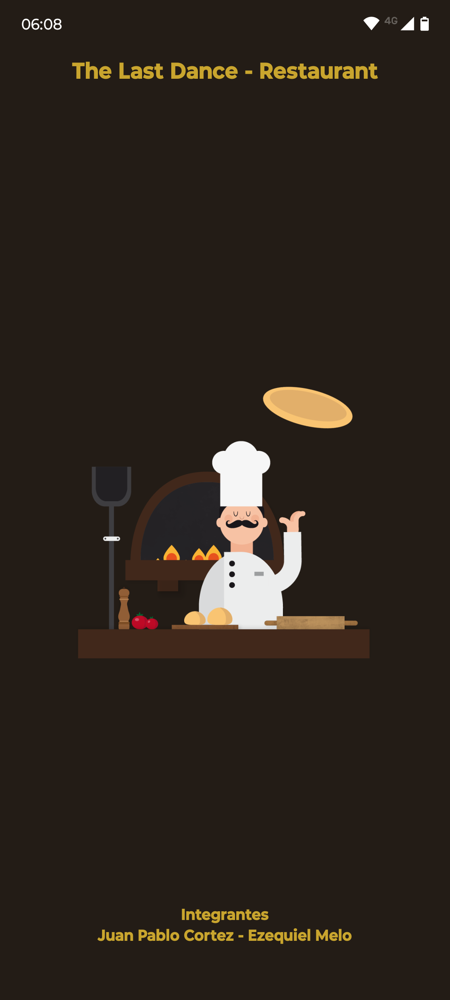 
      <strong>Splash Screen</strong> 
      Pantalla de carga inicial
    </td>
    <td align="center" width="50%">
      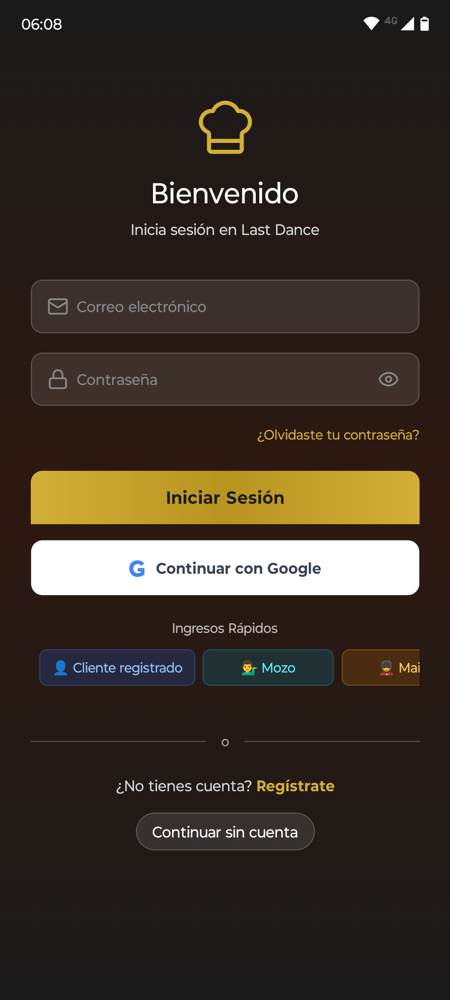 
      <strong>Login</strong> 
      Pantalla de inicio de sesion
    </td>
  </tr>
  <tr>
    <td align="center">
      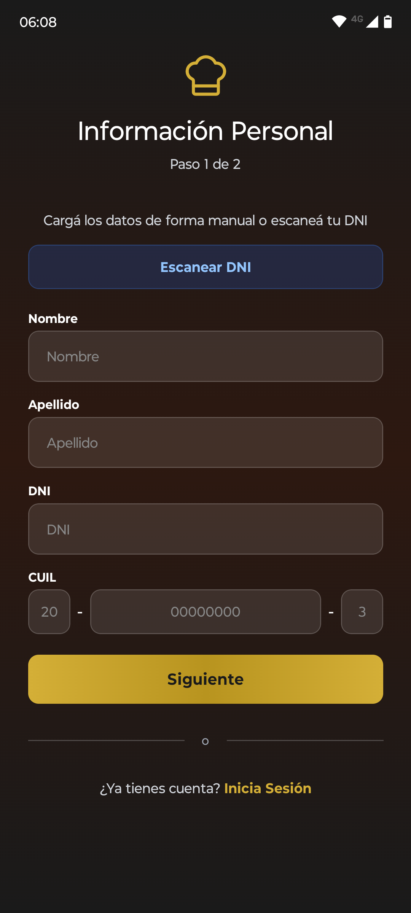 
      <strong>Pantalla de registro</strong> 
      Pantalla de registro de usuarios
    </td>
    <td align="center">
      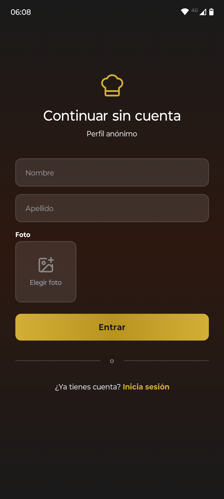 
      <strong>Pantalla de registro de usuarios anonimos</strong> 
      Pantalla de registro de usuarios de tipo anonimos
    </td>
  </tr>
  <tr>
    <td align="center">
      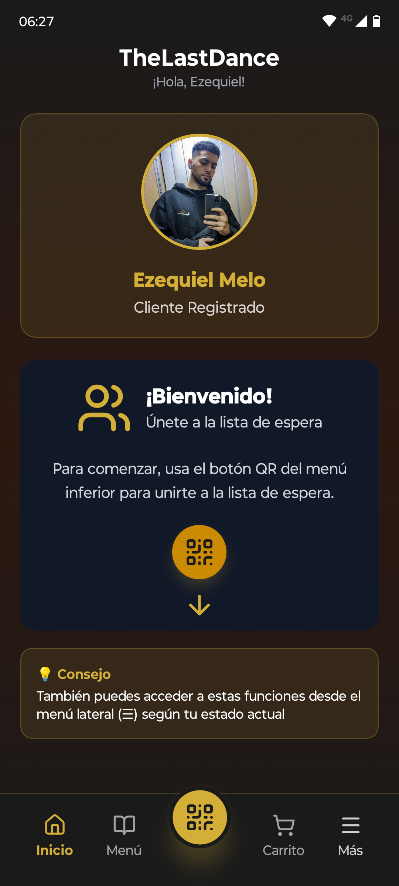 
      <strong>Home Cliente</strong> 
      Pantalla inicial y principal de cliente
    </td>
    <td align="center">
      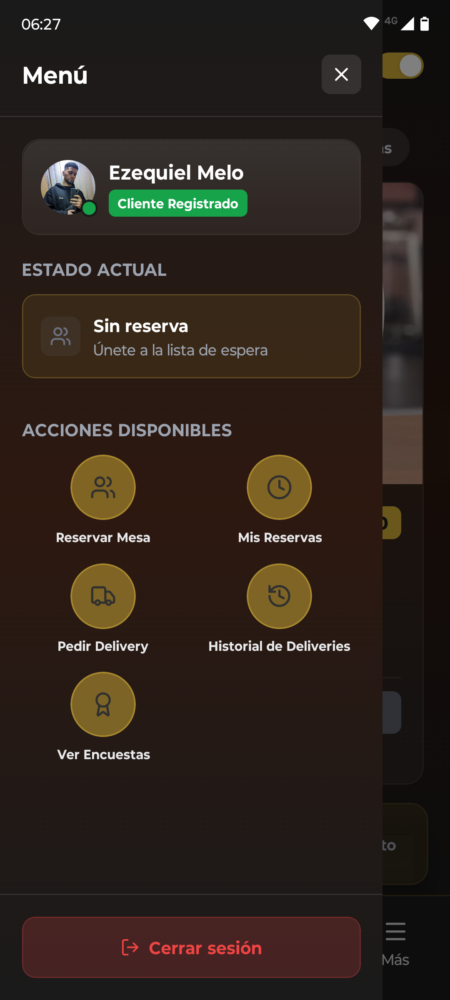 
      <strong>Sidebar Cliente</strong> 
      Sidebar accesible desde menu burguer para los clientes
    </td>
  </tr>
  <tr>
    <td align="center">
      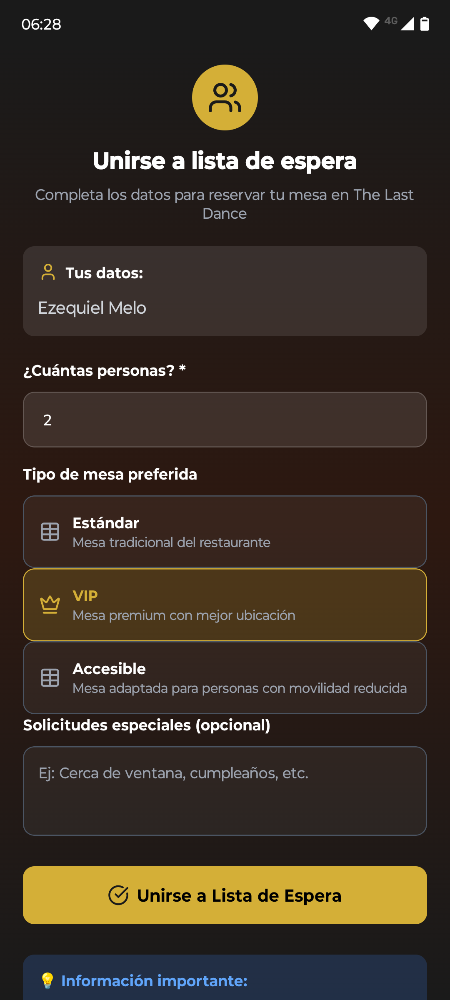 
      <strong>Pantalla para unirse a la lista de espera</strong> 
      Pantalla que utiliza el cliente para unirse a la lista de espera
    </td>
    <td align="center">
      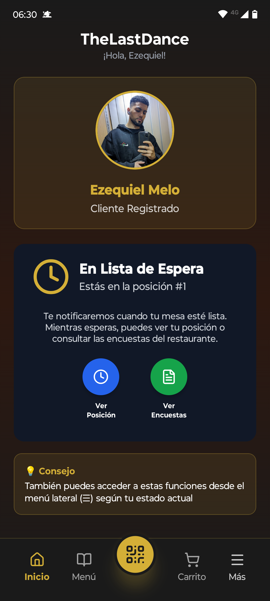 
      <strong>Estado del cliente dentro de una lista de espera</strong> 
      Estado que ve el cliente en su pantalla principal cuando se encuentra en una lista de espera
    </td>
  </tr>
  <tr>
    <td align="center">
      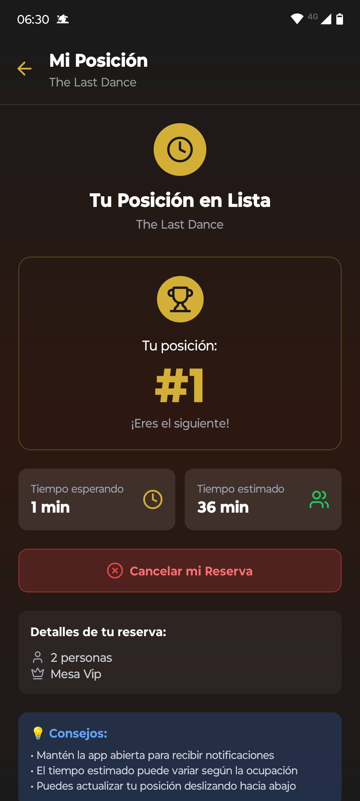 
      <strong>Posicion en la lista de espera</strong> 
      Pantalla en la cual el cliente ve en que posicion se encuentra en la lista de espera (ademas de poder cancelar la espera)
    </td>
    <td align="center">
       
      <strong>Resultados de encuestas</strong> 
      Pantalla donde el cliente puede visualizar el resultado de las encuestas
    </td>
  </tr>
  <tr>
    <td align="center">
      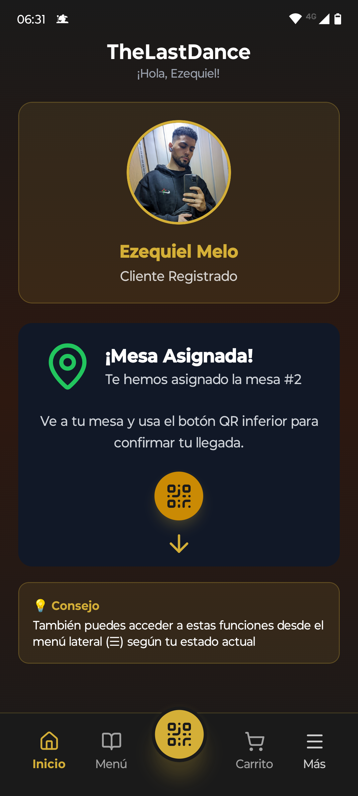 
      <strong>Mesa asignada Cliente</strong> 
      Pantalla donde el usuario ve la mesa que tiene asignada y puede acceder a escanear el qr de esta
    </td>
    <td align="center">
      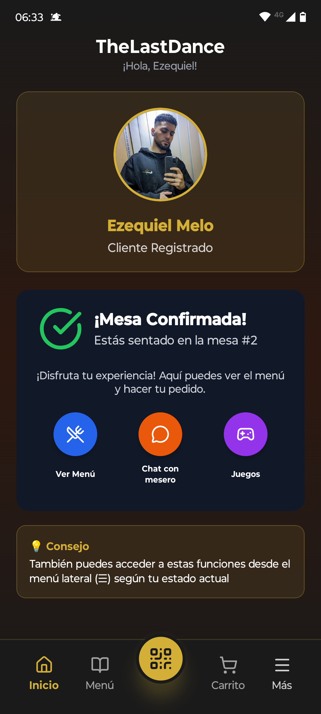 
      <strong>Mesa confirmada Cliente</strong> 
      Pantalla donde el usuario ve que su mesa esta confirmada luego de scanear el qr de la mesa
    </td>
  </tr>
   <tr>
    <td align="center">
      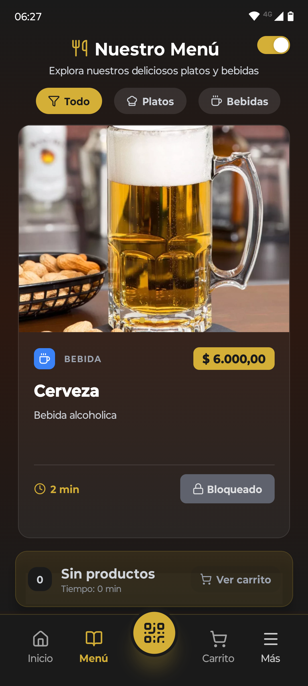 
      <strong>Menu Cliente</strong> 
      Pantalla donde el cliente puede ver el menu completo
    </td>
    <td align="center">
      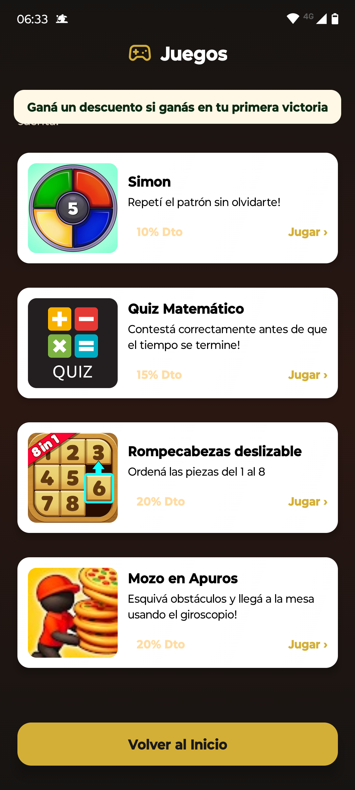 
      <strong>Juegos</strong> 
      Pantalla donde el usuario ve y puede acceder a los distintos juegos para ganar un descuento
    </td>
  </tr>
   <tr>
    <td align="center">
      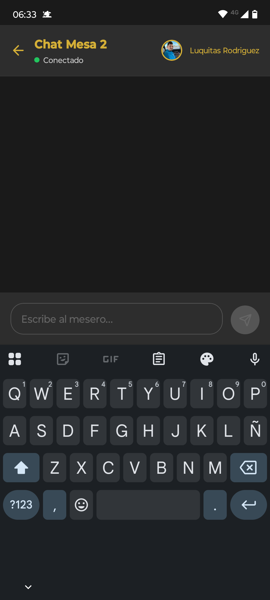 
      <strong>Chat cliente</strong> 
      Pantalla donde el usuario puede chatear con los mozos (aplica para otros chats)
    </td>
    <td align="center">
      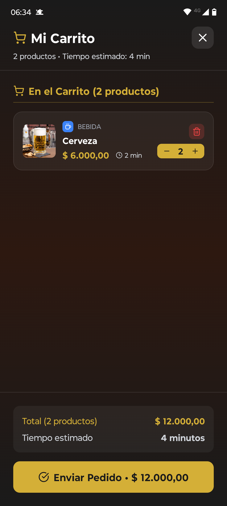 
      <strong>Carrito cliente</strong> 
      Carrito donde el usuario sumas sus productos para enviarlos al mozo
    </td>
  </tr>
   <tr>
    <td align="center">
      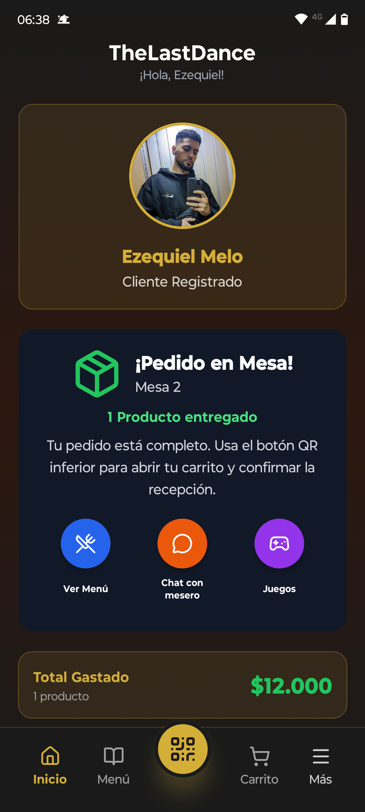 
      <strong>Productos en la mesa</strong> 
      Pantalla donde el cliente ve que ya tiene los productos en su mesa
    </td>
    <td align="center">
      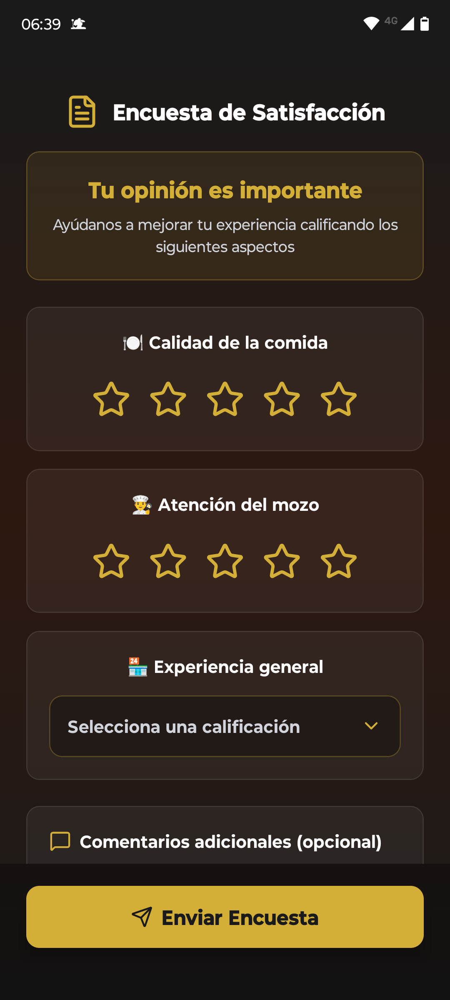 
      <strong>Responder encuesta Cliente</strong> 
      Pantalla donde el usuario puede responder a la encuesta
    </td>
  </tr>
   <tr>
    <td align="center">
      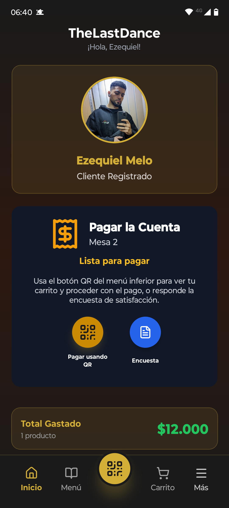 
      <strong>Solicitud de pago de cuenta</strong> 
      Pantalla que ve el usuario luego de que confirme que quiere pagar la cuenta
    </td>
    <td align="center">
      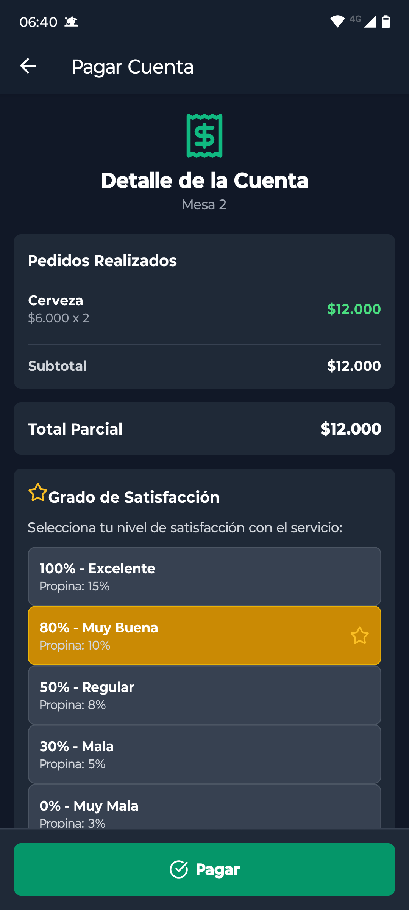 
      <strong>Pago de la cuenta</strong> 
      Pantalla que ve el usuario mientras esta pagando la cuenta
    </td>
  </tr>
     <tr>
    <td align="center">
      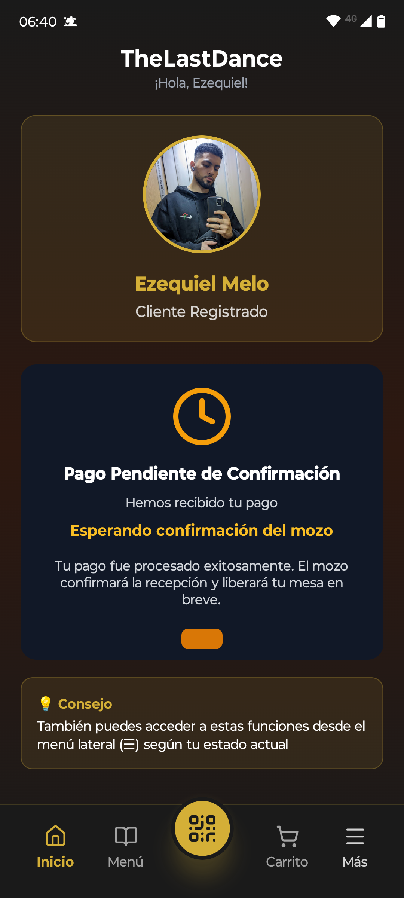 
      <strong>Esperando confirmacion de pago</strong> 
      Pantalla que ve el usuario luego de pagar y espera la confirmacion de pago por parte del mozo
    </td>
    <td align="center">
      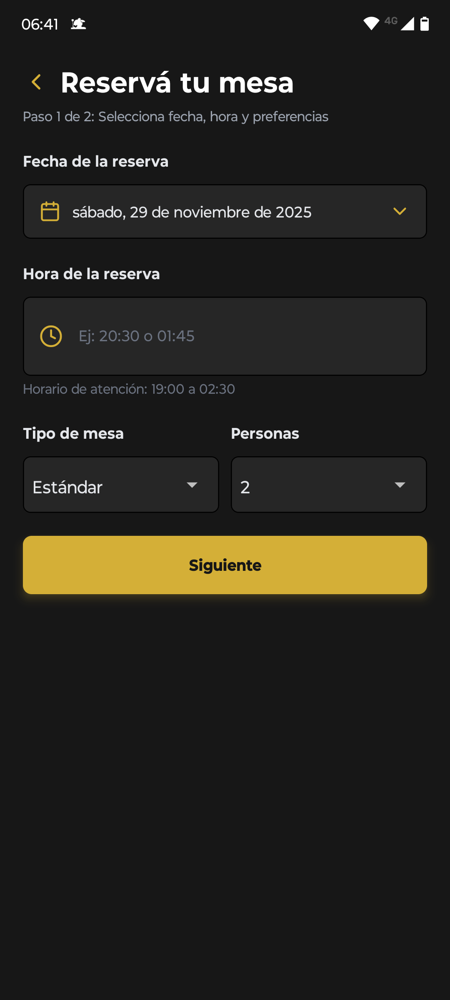 
      <strong>Formulario de reserva parte 1</strong> 
      Formulario que debe llenar el cliente para hacer una reserva (parte 1)
    </td>
  </tr>
     <tr>
    <td align="center">
      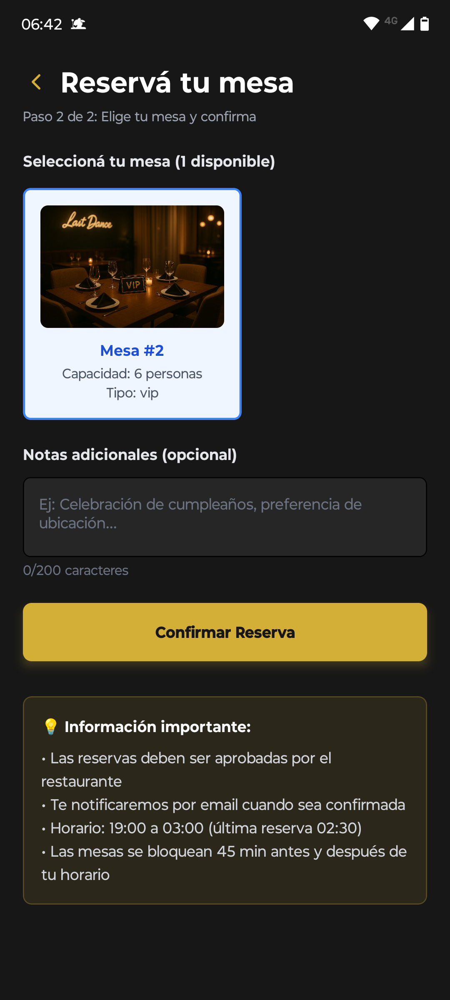 
      <strong>Formulario de reserva parte 2</strong> 
      Formulario que debe llenar el cliente para hacer una reserva (parte 2)
    </td>
    <td align="center">
      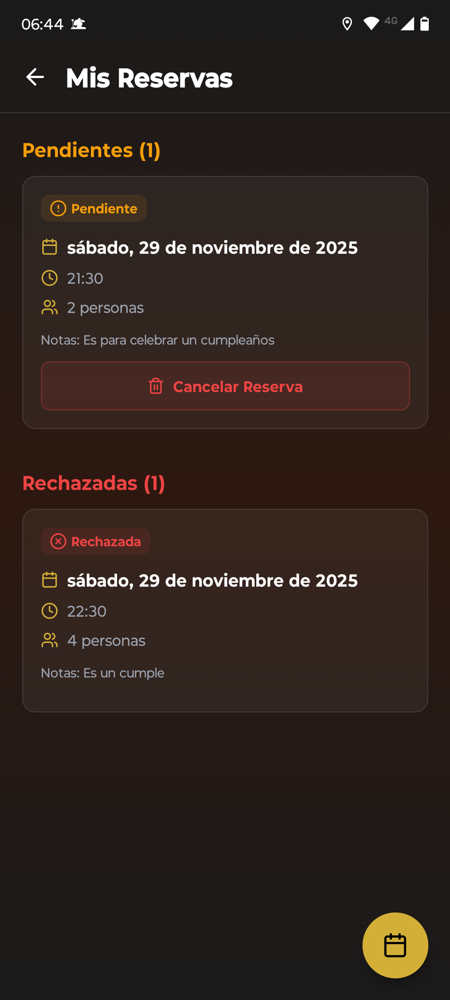 
      <strong>Mis reservas</strong> 
      Pantalla donde el usuario ve el estado de sus reservas
    </td>
  </tr>
     <tr>
    <td align="center">
       
      <strong>Formulario de delivery</strong> 
      Pantalla donde el usuario deja sus datos para acceder al delivery
    </td>
    <td align="center">
      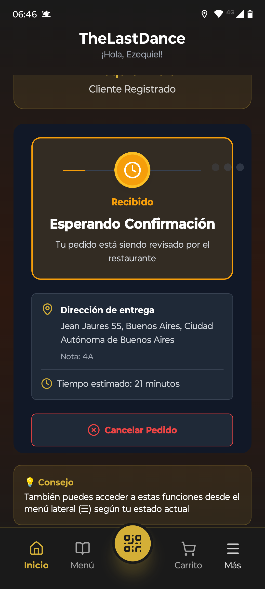 
      <strong>Esperando confirmacion de delivery</strong> 
      Pantalla donde el usuario ve que su pedido ya fue enviado pero esta aun sin confirmar
    </td>
  </tr>
     <tr>
    <td align="center">
      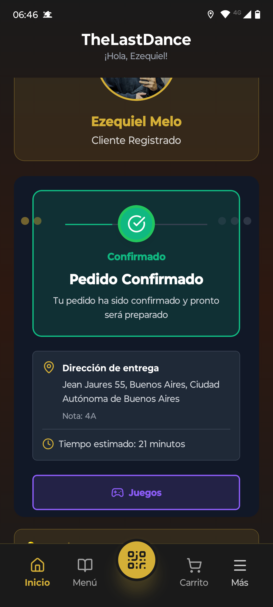 
      <strong>Confirmacion de delivery</strong> 
      Pantalla que ve el usuario ve que su pedido fue aceptado
    </td>
    <td align="center">
      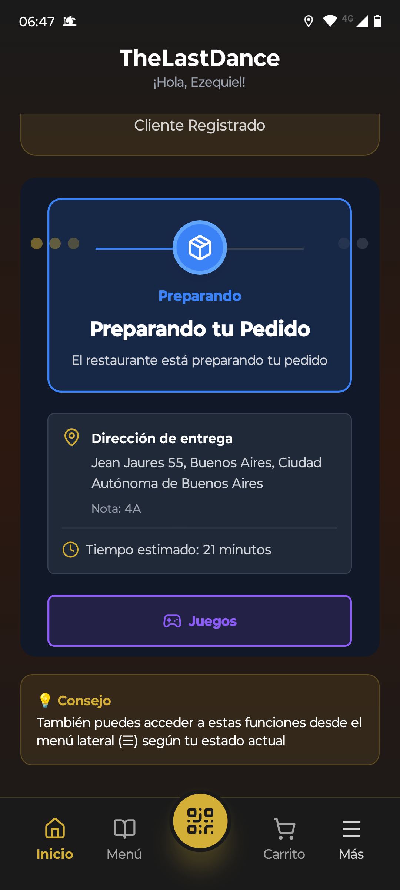 
      <strong>Pedido en preparacion</strong> 
      Pantalla donde el usuario ve que su pedido ya se encuentra en preparacion
    </td>
  </tr>
     <tr>
    <td align="center">
      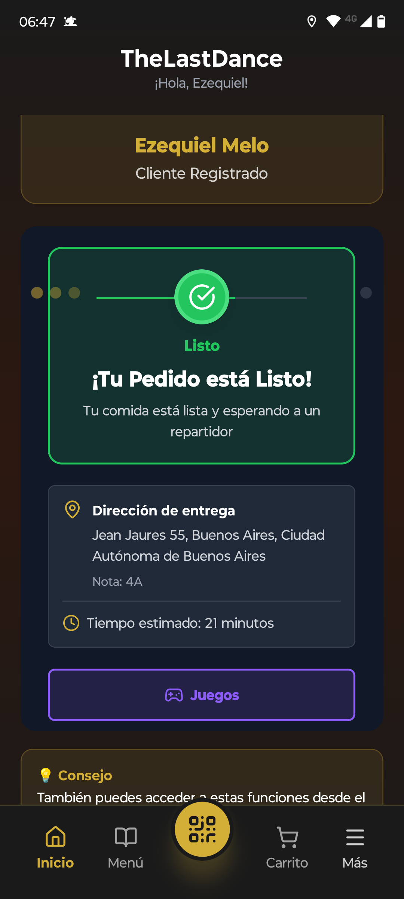 
      <strong>Pedido listo</strong> 
      Pantalla donde el usuario ve que su pedido ya esta preparado y listo para enviar
    </td>
    <td align="center">
       
      <strong>Pedido en camino</strong> 
      Pantalla donde el usuario ve que su pedido ya se encuentra en camino
    </td>
  </tr>
       <tr>
    <td align="center">
      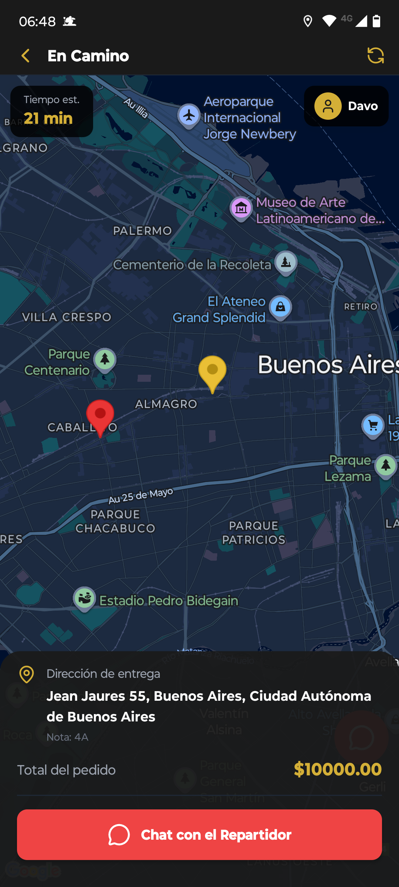 
      <strong>Seguimiento del pedido</strong> 
      Pantalla donde el usuario ve donde se encuentra el conductor de su pedido
    </td>
    <td align="center">
      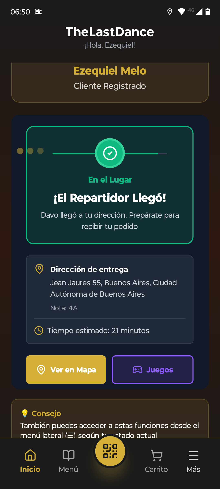 
      <strong>Pedido en el lugar</strong> 
      Pantalla donde el usuario ve que su pedido ya se encuentra en su casa
    </td>
  </tr>
       <tr>
    <td align="center">
      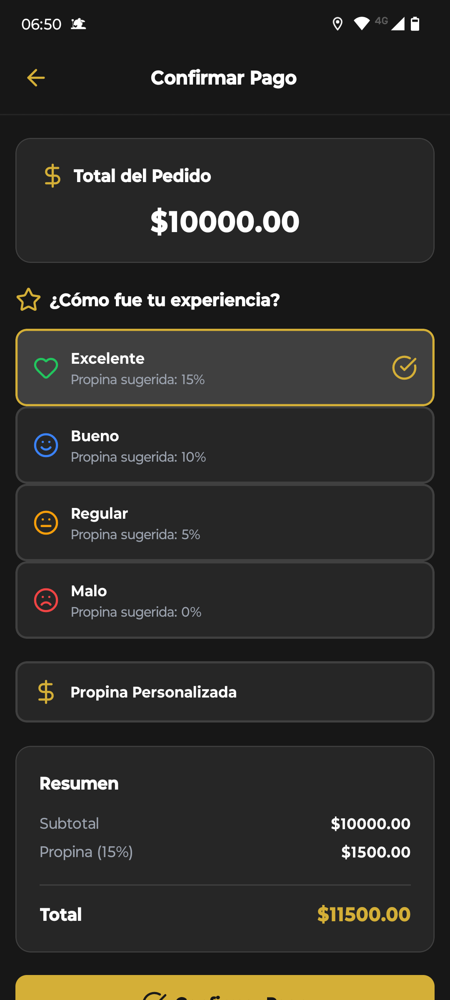 
      <strong>Pagar pedido</strong> 
      Pantalla donde el usuario efectua el pago de su pedido
    </td>
    <td align="center">
       
      <strong>Pedido en camino</strong> 
      Pantalla donde el usuario ve que su pedido ya se encuentra en camino
    </td>
  </tr>
       <tr>
    <td align="center">
       
      <strong>Pedido listo</strong> 
      Pantalla qdonde el usuario ve que su pedido ya esta preparado y listo para enviar
    </td>
    <td align="center">
       
      <strong>Pedido en camino</strong> 
      Pantalla donde el usuario ve que su pedido ya se encuentra en camino
    </td>
  </tr>
</table>

  <em>Estas capturas corresponden a la versión actual de la app desarrollada en Expo (React Native).</em>

<h2 id="bitacora-commits">📝 Bitácora de Commits (hitos)</h2>

<!--
Sugerencia: registrar aquí los hitos o commits importantes (no todos).
Formato recomendado:
- Fecha (YYYY-MM-DD) · Autor · Ramas/Áreas · Mensaje breve · Hash corto/enlace
-->

<ul>
  <!-- EJEMPLOS -->
  <li><strong>2025-09-12</strong> · Juan Pablo · backend:fix · Corrige handler 404 para Express 5 · </li>
</ul>

<h2 id="secciones-por-integrante">👤 Lista de tareas por Integrante</h2>

Cada integrante gestiona su lista de tareas y progreso.  

<!-- ==================== EZEQUIEL ==================== -->
<h3 id="seccion-ezequiel-melo">Ezequiel Melo (Líder)</h3>

  
Lista de tareas

  <!-- Marcar con [x] cuando se complete -->
  <ul>
    <li>[x] Crear esqueleto del proyecto y comunicarlo con el equipo</li>
    <li>[x] Coordinar reunion con el equipo</li>
    <li>[x] SplashScreen animado</li>
    <li>[x] Autenticacion en backend completo</li>
    <li>[x] Listado de usuarios en estado pendiente desde usuario Dueño</li>
    <li>[x] Deploy del backend en Render</li>
    <li>[x] Sistema de Mesas y listas de espera</li>
    <li>[x] Chat cliente - mesero</li>
    <li>[x] Sistema de meseros</li>
    <li>[x] Sistema de meseros</li>
    <li>[x] Correcciones: Cambios en el sistema de QR</li>
    <li>[x] Correcciones: Menu que muestra un producto a la vez</li>
    <li>[x] Sistema de login con redes sociales</li>
    <li>[x] Sistema pedidos a domicilio</li>
  </ul>

<!-- ==================== MAXIMO ==================== -->
<h3 id="seccion-maximo-pasqui">Máximo Pasqui</h3>

  
Lista de tareas

  <ul>
    <li>[x] Login funcional completo</li>
    <li>[x] Registro de usuario completo</li>
    <li>[x] Version preliminar del SplashScreen</li>
    <li>[x] Creacion de juegos</li>
  </ul>

<!-- ==================== JUAN PABLO ==================== -->
<h3 id="seccion-juan-pablo-cortez">Juan Pablo Cortez</h3>

  
Lista de tareas

  <ul>
    <li>[x] Crear base de datos y conectarla con el Backend</li>
    <li>[x] Menú en el backend: menuServices - menuController - menuRoutes y los tipos</li>
    <li>[x] Entidades en la base de datos menu - usuarios - etc</li>
    <li>[x] Mail de la compañia</li>
    <li>[x] Envios de mail notifando estado de cuenta</li>
    <li>[x] Formulario para crear empleados/supervisores con lectura QR y Camara de fotos.</li>
    <li>[x] Visualizacion del menu en los clientes</li>
    <li>[x] Push notifications</li>
    <li>[x] Creacion de pedidos</li>
    <li>[x] Sistema de descuentos asociado a los juegos</li>
    <li>[x] Correcciones: Tamaños de fuentes</li>
    <li>[x] Correcciones: Ingresos rapidos</li>
    <li>[x] Sistema de encuestas</li>
    <li>[x] Sistema de reserva de mesas</li>
  </ul>

<h2 id="reglas-de-trabajo">🏁 Reglas de Trabajo</h2>

<ol>
  <li><strong>Asignación de tareas:</strong> El Líder (Ezequiel) asigna y prioriza en la Lista de tareas.</a>.</li>
  <li><strong>Estados:</strong> Actualizar al terminar ([x]).</li>
  <li><strong>Commits:</strong> Mensajes claros.</li>
  <li><strong>Sincronización:</strong> Reunión corta semanal para revisar progreso y replanificar.</li>
</ol>

<h2 id="como-actualizar">🛠️ Cómo actualizar este README</h2>

<ul>
  <li>Para marcar una tarea como completada, cambiá <code>[ ]</code> por <code>[x]</code>.</li>
  <li>En la <a href="#bitacora-commits">Bitácora de Commits</a>, agregá solo los hitos relevantes.</li>
</ul>

  Plantilla inicial · Actualizar según necesidades del proyecto.

