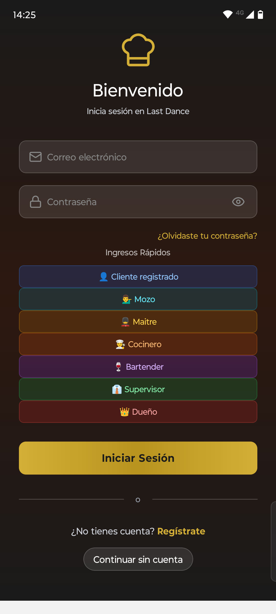
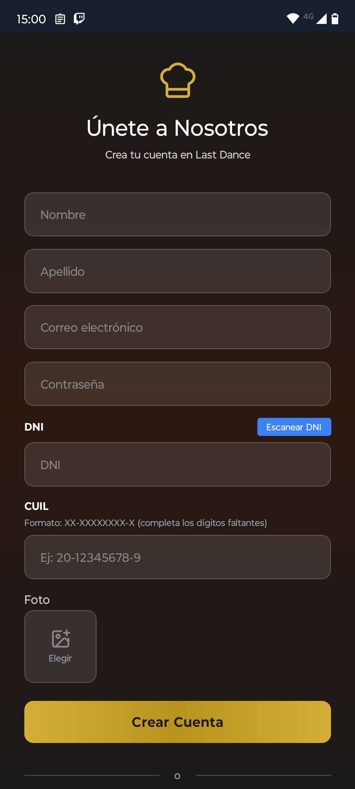
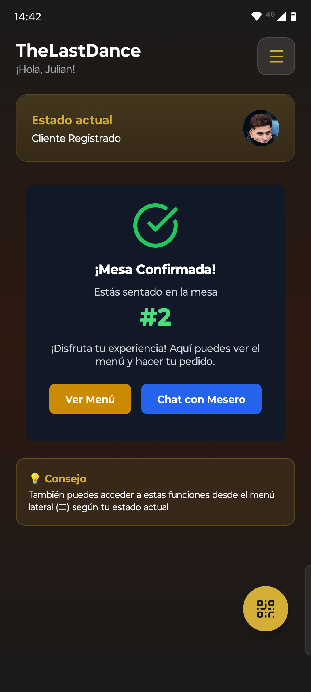
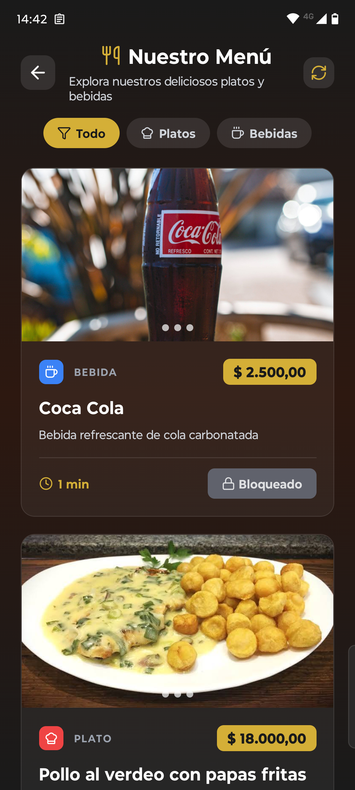
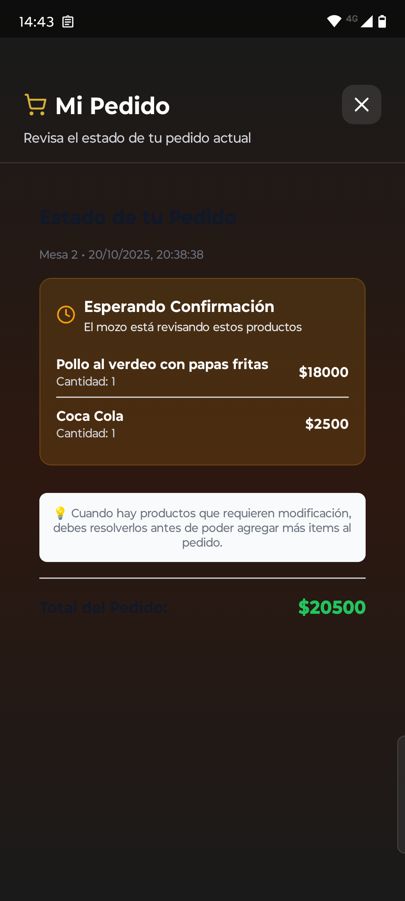
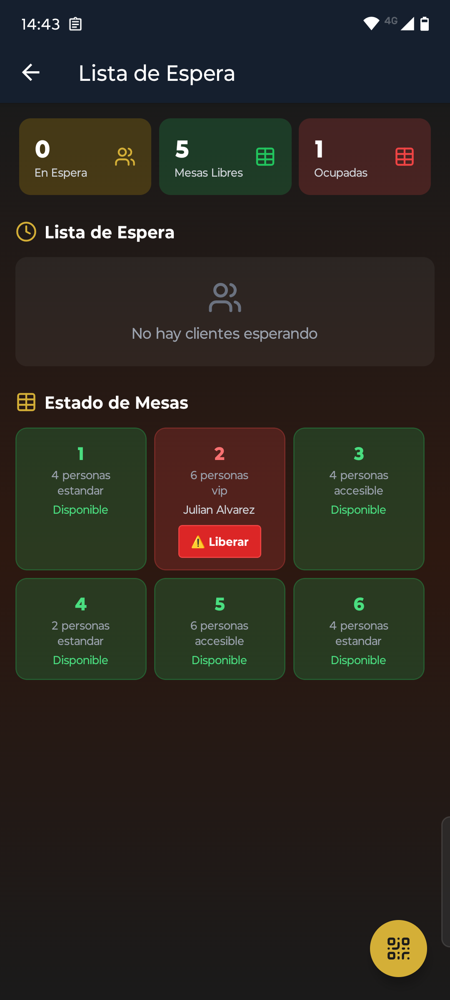
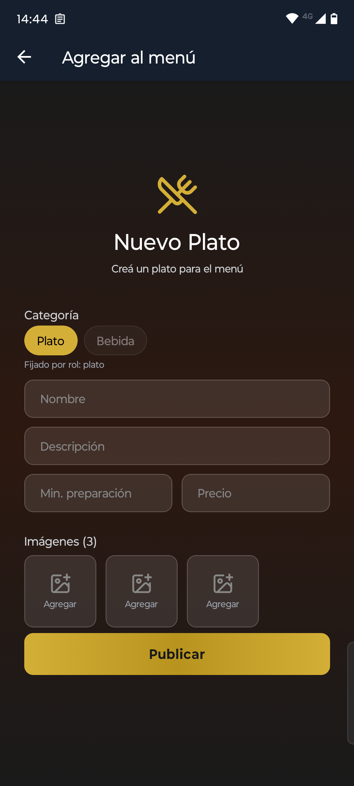
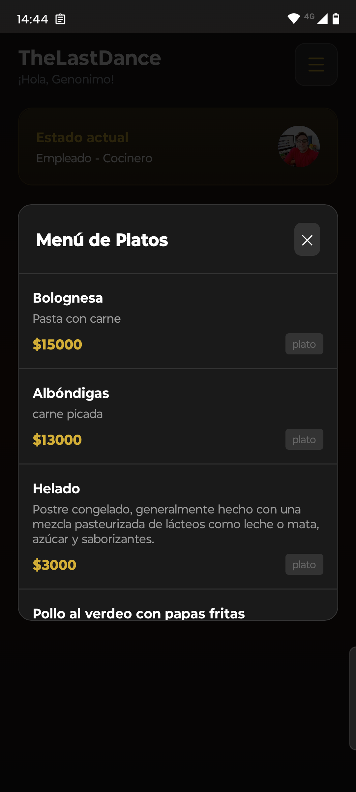
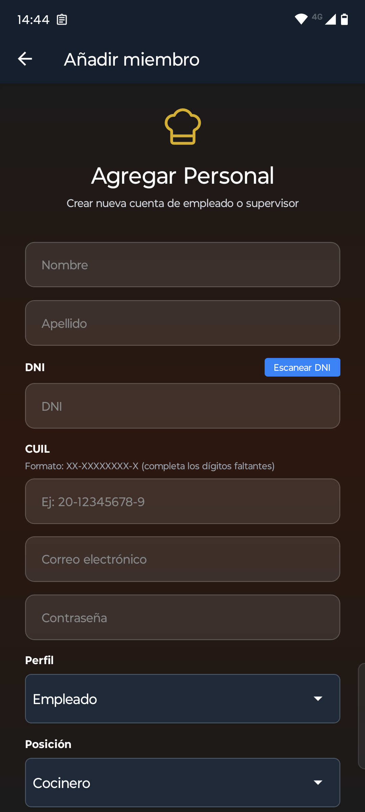
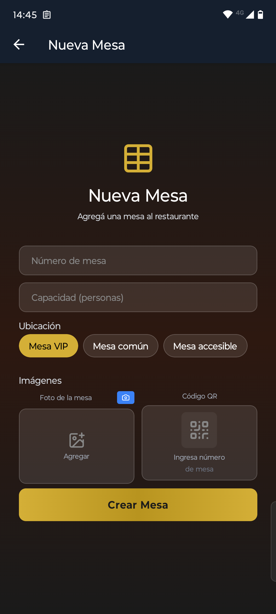

<!-- README: TheLastDance-2025 -->
<h1 align="center">The Last Dance – Equipo de Proyecto</h1>

  <strong>Integrantes:</strong>
  <a href="#seccion-ezequiel-melo">Ezequiel Melo (Líder)</a> ·
  <a href="#seccion-maximo-pasqui">Máximo Pasqui</a> ·
  <a href="#seccion-juan-pablo-cortez">Juan Pablo Cortez</a>

  <em>Este documento centraliza asignación de tareas (por el Líder), seguimiento (pendiente/completada) y registro de commits relevantes.</em>

<h2 id="preview-app" align="center">📱 Vista previa de la App</h2>

  A continuación se muestran algunas pantallas representativas de la aplicación móvil desarrollada por el equipo <strong>The Last Dance</strong>.

  <!-- Pantalla de Login -->
  

    
    
<strong>Pantalla de Login</strong> Permite a los usuarios acceder con su cuenta registrada.

  

  <!-- Pantalla de Registro -->
  

    
    
<strong>Pantalla de Registro</strong> Formulario de creación de cuenta para nuevos usuarios.

  

  <!-- Pantalla Principal -->
  

    
    
<strong>Pantalla Principal</strong> Vista inicial de la pantalla de cliente.

  

  <!-- Menú Cliente -->
  

    
    
<strong>Menú - Cliente</strong> Visualización de todos los productos disponibles.

  

  <!-- Carrito Cliente -->
  

    
    
<strong>Carrito - Cliente</strong> Permite ver el pedido actual y su estado.

  

  <!-- Lista de Espera -->
  

    
    
<strong>Lista de Espera - Maitre</strong> Gestión visual de mesas y turnos pendientes.

  

  <!-- Añadir Platos -->
  

    
    
<strong>Añadir Platos - Cocinero</strong> Formulario para crear nuevos platos o bebidas.

  

  <!-- Visualizar Platos -->
  

    
    
<strong>Visualizar Platos - Cocinero</strong> Listado de todos los platos disponibles.

  

  <!-- Pedidos Cocinero -->
  

    
    
<strong>Pedidos y Estados - Cocinero</strong> Monitoreo de pedidos en preparación.

  

  <!-- Agregar Personal -->
  

    
    
<strong>Agregar Personal - Dueño/Supervisor</strong> Formulario para registrar nuevos empleados.

  

  <!-- Agregar Mesa -->
  

    
    
<strong>Agregar Mesa - Dueño/Supervisor</strong> Formulario para registrar nuevas mesas.

  

  <!-- Gestión de Meseros -->
  

    
    
<strong>Gestión de Meseros - Dueño/Supervisor</strong> Visualización de meseros y sus mesas asignadas.

  

  <em>Estas capturas corresponden a la versión actual de la app desarrollada en Expo (React Native).</em>

<h2 id="bitacora-commits">📝 Bitácora de Commits (hitos)</h2>

<!--
Sugerencia: registrar aquí los hitos o commits importantes (no todos).
Formato recomendado:
- Fecha (YYYY-MM-DD) · Autor · Ramas/Áreas · Mensaje breve · Hash corto/enlace
-->

<ul>
  <!-- EJEMPLOS -->
  <li><strong>2025-09-12</strong> · Juan Pablo · backend:fix · Corrige handler 404 para Express 5 · </li>
</ul>

<h2 id="secciones-por-integrante">👤 Lista de tareas por Integrante</h2>

Cada integrante gestiona su lista de tareas y progreso.  

<!-- ==================== EZEQUIEL ==================== -->
<h3 id="seccion-ezequiel-melo">Ezequiel Melo (Líder)</h3>

  
Lista de tareas

  <!-- Marcar con [x] cuando se complete -->
  <ul>
    <li>[x] Crear esqueleto del proyecto y comunicarlo con el equipo</li>
    <li>[x] Coordinar reunion con el equipo</li>
    <li>[x] SplashScreen animado</li>
    <li>[x] Autenticacion en backend completo</li>
    <li>[x] Listado de usuarios en estado pendiente desde usuario Dueño</li>
    <li>[x] Deploy del backend en Render</li>
    <li>[x] Sistema de Mesas y listas de espera</li>
    <li>[x] Chat cliente - mesero</li>
    <li>[x] Sistema de meseros - </li>
  </ul>

<!-- ==================== MAXIMO ==================== -->
<h3 id="seccion-maximo-pasqui">Máximo Pasqui</h3>

  
Lista de tareas

  <ul>
    <li>[x] Login funcional completo</li>
    <li>[x] Registro de usuario completo</li>
    <li>[x] Version preliminar del SplashScreen</li>
    <li>[x] Creacion de juegos</li>
    <li>[x] Sistema de descuentos asociado a los juegos</li>
  </ul>

<!-- ==================== JUAN PABLO ==================== -->
<h3 id="seccion-juan-pablo-cortez">Juan Pablo Cortez</h3>

  
Lista de tareas

  <ul>
    <li>[x] Crear base de datos y conectarla con el Backend</li>
    <li>[x] Menú en el backend: menuServices - menuController - menuRoutes y los tipos</li>
    <li>[x] Entidades en la base de datos menu - usuarios - etc</li>
    <li>[x] Mail de la compañia</li>
    <li>[x] Envios de mail notifando estado de cuenta</li>
    <li>[x] Formulario para crear empleados/supervisores con lectura QR y Camara de fotos.</li>
    <li>[x] Visualizacion del menu en los clientes</li>
    <li>[x] Push notifications</li>
    <li>[x] Creacion de pedidos</li>
  </ul>

<h2 id="reglas-de-trabajo">🏁 Reglas de Trabajo</h2>

<ol>
  <li><strong>Asignación de tareas:</strong> El Líder (Ezequiel) asigna y prioriza en la Lista de tareas.</a>.</li>
  <li><strong>Estados:</strong> Actualizar al terminar ([x]).</li>
  <li><strong>Commits:</strong> Mensajes claros.</li>
  <li><strong>Sincronización:</strong> Reunión corta semanal para revisar progreso y replanificar.</li>
</ol>

<h2 id="como-actualizar">🛠️ Cómo actualizar este README</h2>

<ul>
  <li>Para marcar una tarea como completada, cambiá <code>[ ]</code> por <code>[x]</code>.</li>
  <li>En la <a href="#bitacora-commits">Bitácora de Commits</a>, agregá solo los hitos relevantes.</li>
</ul>

  Plantilla inicial · Actualizar según necesidades del proyecto.

